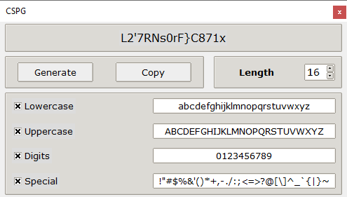

# About

SimplePG - Simple and convenient password generator using a cryptographically strong random number generator.

</img>

# Versions used
<table border=0 align='left' style='text-align: center;' cellspacing="0", cellpadding="5">
  <thead>
    <tr>
      <th>name</th>
      <th>version</th>
    </tr>
  </thead>
  <tr>
    <td align="center">Tkinter</td>
    <td align="center">8.9</td>
  </tr>
  <tr>
    <td align="center">Python</td>
    <td align="center">3.11.0</td>
  </tr>
</table>
